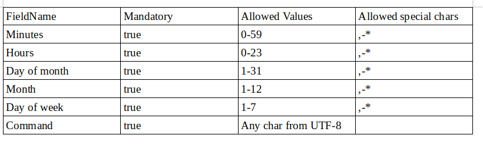

##### How to run application
1. Downland and install jdk 11 - https://www.oracle.com/technetwork/java/javase/downloads/jdk11-downloads-5066655.html
2. Execute in the root of the project:
`java -jar cronParser.jar "parameter1"` , where the parameter1 is cron expression

##### How to build application
1. Downland and install jdk 11 - https://www.oracle.com/technetwork/java/javase/downloads/jdk11-downloads-5066655.html
2. Download and install latest version of maven - https://maven.apache.org/
3. Execute in root of the project:

`mvn clean package`

you can find in `target/cronParser.jar` executable file 

##### Limitation of application
You can find in this table limitations of the application

